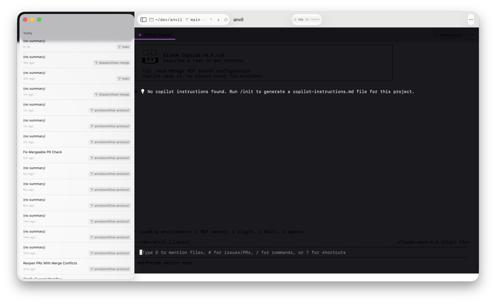

# Anvil

A native macOS app that wraps the GitHub Copilot CLI in a beautiful, full-featured IDE experience.

> **Last updated**: 2026-02-27 22:55 UTC

## Screenshot



## Features

- 🗂️ File explorer with git status indicators
- ✏️ Syntax-highlighted file preview
- 🔀 Inline diff viewer for changes
- 🖥️ Integrated terminal with Copilot CLI
- 📋 Git commit history browser
- 🔍 Project-wide search
- 🤖 Agent activity feed

## Build

```bash
swift build
```

## Design

Built with SwiftUI. Target aesthetic: clean, minimal, polished native macOS feel.
Design reference: [postrboard.com](https://postrboard.com)
